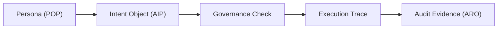

# verifiable-agent-demo

一个最小可运行 demo，展示 AI / Agent 工作流如何从 intent 生成 trace、evidence bundle、replay verdict 和 audit receipt。<br>
A minimal runnable demo for auditable AI agent workflows.

This repository is the walkthrough demo for the execution-evidence path. It is the guided walkthrough surface across the stack, not the canonical architecture hub and not the canonical evidence-profile spec.

## What this demo shows

这个仓库不是理论入口，而是“能跑出来”的可信 AI 工作流演示。它把一次 Agent 执行拆成可以复核的 artifact chain：

- intent 输入：说明 Agent 要做什么
- policy / rule reference：说明执行前参考了什么规则或治理约束
- execution trace：记录执行过程和事件链
- evidence bundle：把执行证据打包为可交付对象
- replay / verification result：给出复核或回放结果
- audit receipt：把本次执行的关键证据收束成审计收据

核心目标不是让 AI 回答更多内容，而是让一次 AI / Agent 执行过程可追踪、可复核、可审计。

## Navigation

- Evidence -> [agent-evidence](https://github.com/joy7758/agent-evidence)
- Architecture -> [digital-biosphere-architecture](https://github.com/joy7758/digital-biosphere-architecture)
- Audit -> [aro-audit](https://github.com/joy7758/aro-audit)
- Governance -> [token-governor](https://github.com/joy7758/token-governor)

## Quick Start

### 1. 最小本地路径

```bash
python3 -m demo.agent
```

默认输出写入 `artifacts/demo_output/`，包括：

- `interaction/intent.json`
- `interaction/action.json`
- `interaction/result.json`
- `evidence/example_audit.json`
- `evidence/result.json`

### 2. 脚本包装路径

```bash
bash scripts/run_demo.sh
```

这个 wrapper 会刷新 `artifacts/demo_output/` 下的本地 demo 输出。

### 3. Enterprise sandbox artifact chain

```bash
python3 examples/enterprise_sandbox_demo/run.py
```

这个路径展示从 intent 到 audit receipt 的更完整闭环，输出目录为 `artifacts/enterprise_sandbox_demo/`。

The receipt for the enterprise sandbox chain is checked through the canonical ARO surface `aro_audit.receipt_validation` with the `minimal` profile.

## Generated Artifacts

Enterprise sandbox demo 会生成：

- `intent.json`
- `policy.json`
- `trace.jsonl`
- `sep.bundle.json`
- `replay_verdict.json`
- `audit_receipt.json`

这些 artifact 对应一条最小审计链：意图输入、策略约束、执行轨迹、证据包、回放判断、审计收据。

## Why it matters

很多 Agent demo 只展示“模型能完成任务”。`verifiable-agent-demo` 展示的是另一件事：任务完成之后，是否还能说明它为什么被允许执行、执行时发生了什么、输出能否被复核，以及审计者能拿到什么证据。

这正是可信 AI / Agent Evidence / LangChain 工作流进入生产流程时需要补上的部分。

## Screenshots / GIF

真实截图和 GIF 后续手动补充，不在仓库里生成假图。

计划补充路径：

- `assets/demo-run.gif`
- `assets/artifact-chain.png`
- `assets/audit-receipt.png`

See [assets/README.md](./assets/README.md) for the capture checklist.

## For hiring managers

这个仓库证明我能把 AI Agent 工作流从 PoC 做成可交付、可复核、可审计的最小闭环：有 intent、有规则、有 trace、有 evidence bundle、有 replay verdict、有 audit receipt。

## Current scope

`verifiable-agent-demo` 是执行证据路径的 walkthrough demo。它不是 canonical architecture hub、不是 canonical evidence-profile spec，也不是 audit control plane。

如果你只想看能跑的闭环，从本 README 的 Quick Start 开始。如果你想看 evidence profile 和 validator，去 [agent-evidence](https://github.com/joy7758/agent-evidence)。如果你想看更完整的架构地图，去 [digital-biosphere-architecture](https://github.com/joy7758/digital-biosphere-architecture)。

Shared doctrine:

**Sandbox controls execution; portable evidence verifies execution.**

1. Governance decides what should be allowed.
2. Execution integrity proves what actually happened.
3. Audit evidence exports artifacts for independent review.



## Existing demo paths

Fastest external demo path:

```bash
bash scripts/run_demo.sh
make killer-demo
python3 -m http.server --directory docs 8000
```

Existing CrewAI demo path:

```bash
bash scripts/setup_framework_venv.sh
.venv/bin/python crew/crew_demo.py
```

Environment notes:

- Python 3 is sufficient for the minimal local path.
- Refresh the tracked deterministic sample bundle with `python3 scripts/refresh_demo_samples.py`.
- The optional CrewAI and LangChain paths should run from a git-ignored local `.venv/` created by `scripts/setup_framework_venv.sh`.
- The pinned framework helper environment currently uses `crewai 1.10.1`, `langchain 1.2.12`, and `langchain-core 1.2.18`.
- CrewAI currently requires Python `<3.14`.
- Both demo paths use deterministic local mock data and do not require external API calls.

## Documentation

- [Quick walkthrough](docs/quick-walkthrough.md)
- [Interaction flow](docs/interaction-flow.md)
- [Shortest validation loop](docs/shortest-validation-loop.md)
- [Execution evidence demo note](docs/execution-evidence-demo-note.md)
- [Demo artifacts](docs/demo-artifacts.md)
- [Independent verification](docs/independent-verification.md)

## Research evaluation annex

The repository also includes a paper-ready evaluation harness for `Execution Evidence Architecture for Agentic Software Systems: From Intent Objects to Verifiable Audit Receipts`.

Primary entry points:

- `make eval-baseline`
- `make eval-evidence`
- `make eval-external-baseline`
- `make eval-framework-pair`
- `make eval-langchain-pair`
- `make eval-ablation`
- `make falsification-checks`
- `make human-review-kit`
- `make review-sample`
- `make compare`
- `make paper-eval`
- `make top-journal-pack`

The evaluation material is useful for deeper technical review, but it is secondary to the runnable demo path above.

## Minimal reference surface

- `interaction/` for explicit interaction objects
- `evidence/` for audit and result artifacts
- `demo/` and `crew/` for runnable entry points
- `integration/` for persona, intent, and ARO adapters
- `examples/enterprise_sandbox_demo/` for the intent-to-receipt artifact chain
- `docs/spec/` for schema notes and example payloads
