# Verifiable Agent Demo

The minimal end-to-end demonstration for the Digital Biosphere Architecture stack.

This repository connects persona, runtime governance context, execution traceability, and audit evidence into one walkthrough. It is a demo and reference path rather than a general-purpose framework.



## What this demo proves

- a portable persona-oriented entry point can be projected into runtime
- execution steps can be recorded as inspectable evidence
- audit-facing artifacts can be exported as bounded outputs
- the demo exists to show cross-layer coherence, not benchmark superiority

## Architecture Path in this Demo

- Persona Layer -> POP-aligned persona context carried into the run
- Governance Layer -> referenced as the control context for runtime policy and budget constraints
- Execution Integrity Layer -> runtime execution trace and verifiable execution context
- Audit Evidence Layer -> ARO-style exported evidence artifacts

This repository does not claim a full Token Governor integration. It demonstrates a minimal aligned path across the broader stack.

## How to read this demo

This demo is a guided path across layers. It is not the normative specification for each layer, and it points outward to the canonical repositories for those layers: [digital-biosphere-architecture](https://github.com/joy7758/digital-biosphere-architecture), [persona-object-protocol](https://github.com/joy7758/persona-object-protocol), [token-governor](https://github.com/joy7758/token-governor), and [aro-audit](https://github.com/joy7758/aro-audit).

## Expected Artifacts

- persona projection or runtime persona attachment context
- execution trace or runtime record
- audit evidence record
- human-readable summary and walkthrough material

Current concrete examples in this repository include:

- `evidence/example_audit.json`
- `evidence/crew_demo_audit.json`
- `docs/quick-walkthrough.md`
- `docs/shortest-validation-loop.md`

## Run the Demo

### Fastest local path

```bash
python3 examples/minimal_audit_flow/run.py
```

### Scripted wrapper

```bash
bash scripts/run_demo.sh
```

### Existing CrewAI demo path

```bash
venv/bin/python crew/crew_demo.py
```

Environment notes:

- Python 3 is sufficient for the minimal local path.
- The CrewAI path uses the local `venv/` already present in this repository.
- CrewAI currently requires Python `<3.14`; the current working example uses Python 3.13.

## Related Repositories

- [digital-biosphere-architecture](https://github.com/joy7758/digital-biosphere-architecture) -- system overview and canonical architecture hub
- [persona-object-protocol](https://github.com/joy7758/persona-object-protocol) -- portable persona object layer
- [token-governor](https://github.com/joy7758/token-governor) -- runtime governance and budget-policy control layer
- [aro-audit](https://github.com/joy7758/aro-audit) -- audit evidence and conformance-oriented verification layer

## Minimal Reference Surface

- `examples/minimal_audit_flow/` for the shortest runnable path
- `demo/` and `crew/` for preserved demo entry points
- `schemas/` for minimal trace and audit record shapes
- `docs/spec/` for schema notes and example payloads
- `adapters/` for a minimal framework adapter shell

## Further Reading

- [Quick Walkthrough](docs/quick-walkthrough.md)
- [Shortest Validation Loop](docs/shortest-validation-loop.md)
- [Independent Verification](docs/independent-verification.md)
- [Architecture](docs/architecture.md)
- [Demo Artifacts](docs/demo-artifacts.md)
