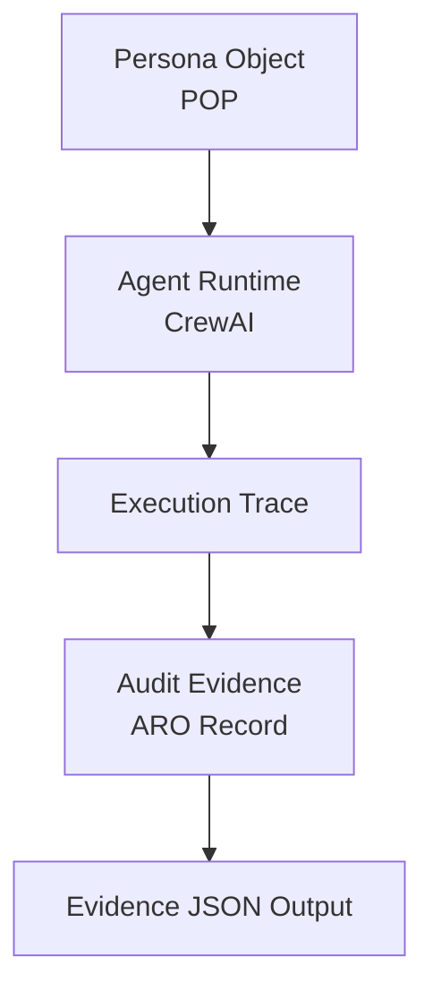

# Verifiable Agent Execution Demo

Minimal governance pipeline for AI agents.

Architecture:

Persona (POP)
-> Agent Runtime
-> Execution Trace
-> Audit Evidence (ARO)

Demo flow:

1. Agent receives task
2. Agent executes action
3. Execution trace recorded
4. Evidence bundle generated

Output example:

`evidence/example_audit.json`

## Architecture

### Architecture Diagram



See detailed explanation:

[docs/architecture.md](docs/architecture.md)

## Architecture (Research View)

See full architecture diagram:

[docs/figures/ai-agent-governance-stack.md](docs/figures/ai-agent-governance-stack.md)

## Framework Integration

This demo can run with CrewAI.

CrewAI currently requires Python `<3.14`, so this repository uses a local `venv`
with Python 3.13 for the integration example.

Setup:

```bash
python3.13 -m venv venv
venv/bin/pip install crewai
```

Example:

```bash
venv/bin/python crew/crew_demo.py
```

The CrewAI example uses a deterministic local mock LLM so the governance
pipeline can run without external API keys.
