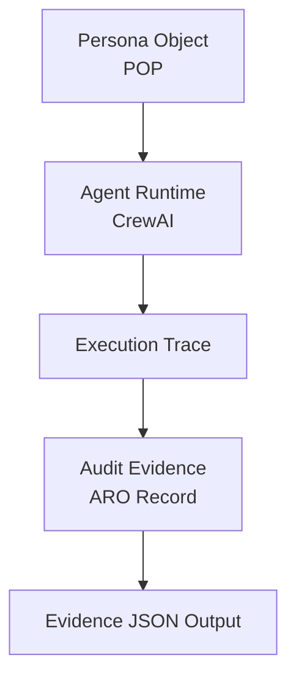

# Verifiable Agent Demo

This demo proves that a compact AI agent workflow can carry persona context,
execute a runtime action, emit an execution trace, and leave behind exportable
evidence.
It matters because verifiable agent systems need more than model output: they
need identity, runtime facts, and audit artifacts that other people can inspect.


## What you will see

1. persona attached
2. runtime action
3. execution trace
4. evidence output

## Run in 5 Minutes

### Environment requirements

- Python 3 for the minimal local demo.
- The CrewAI example uses the existing local `venv/` in this repository.
- CrewAI currently requires Python `<3.14`; the current working example uses Python 3.13.

### Shortest run command

```bash
bash scripts/run_demo.sh
```

Optional CrewAI path:

```bash
venv/bin/python crew/crew_demo.py
```

### What you will see after running

- JSON evidence printed to stdout.
- `evidence/example_audit.json` refreshed by the minimal demo path.
- `evidence/crew_demo_audit.json` refreshed by the CrewAI path.

## Shortest Validation Loop

1. apply persona context
2. run a bounded action
3. emit trace and evidence
4. inspect the artifact
5. independently review the result

See [docs/shortest-validation-loop.md](docs/shortest-validation-loop.md).

## Generated Artifacts

- `evidence/example_audit.json` — minimal ARO-compatible audit record with persona attachment, execution trace, and evidence pointer.
- `evidence/crew_demo_audit.json` — CrewAI-backed audit record with framework metadata, task details, execution trace, and evidence pointer.

These artifacts are the review surface for the shortest validation loop.

## Demo Assets

- `docs/figures/ai-agent-governance-stack.svg` — compact architecture figure for the demo stack.
- `docs/figures/fdo-agent-governance-stack.svg` — extended research framing from FDO to agent governance.
- `poster/index.md` — poster-style outreach page for the demo.
- `outreach/community-post.md` — short community-facing introduction.
- `evidence/example_audit.json` — minimal evidence output.
- `evidence/crew_demo_audit.json` — CrewAI evidence output.

## Architecture

### Architecture Diagram



See the compact architecture explanation in [docs/architecture.md](docs/architecture.md).

## Why this demo is part of Digital Biosphere Architecture

This repository is the fastest execution-facing entry point into the
[Digital Biosphere Architecture](https://github.com/joy7758/digital-biosphere-architecture)
ecosystem.
It shows how persona attachment, runtime behavior, execution trace, and audit
evidence fit together in one inspectable demo, while the parent repository
explains the broader architecture and layer boundaries.

## Technical Paths

### Minimal local demo

- Entry point: `python3 -m demo.agent`
- Wrapper script: `bash scripts/run_demo.sh`
- Output: `evidence/example_audit.json`

### CrewAI integration

- Entry point: `venv/bin/python crew/crew_demo.py`
- Runtime: CrewAI with a deterministic local mock LLM
- Output: `evidence/crew_demo_audit.json`

The CrewAI example uses a deterministic local mock LLM so the governance
pipeline can run without external API keys.

## Further Reading

- [Quick Walkthrough](docs/quick-walkthrough.md)
- [Shortest Validation Loop](docs/shortest-validation-loop.md)
- [Independent Verification](docs/independent-verification.md)
- [Architecture](docs/architecture.md)
- [Research View Diagram](docs/figures/ai-agent-governance-stack.md)
- [FDO -> Agent Governance Architecture](docs/figures/fdo-agent-governance-stack.md)
