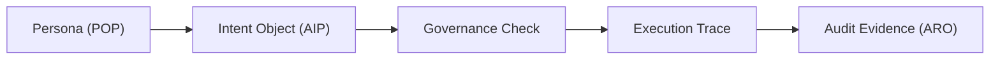

# Verifiable Agent Demo

The minimal end-to-end demonstration for the Digital Biosphere Architecture stack.

This repository connects persona, interaction semantics, governance context, execution traceability, and audit evidence into one walkthrough. It is a demo and reference path rather than a general-purpose framework.



## What this demo proves

- a portable persona-oriented entry point can be projected into runtime
- explicit intent and action objects can be emitted before execution
- result objects can be emitted after execution
- execution steps can be recorded as inspectable evidence
- audit-facing artifacts can be exported as bounded outputs

## Architecture Path in this Demo

- Persona Layer -> POP-aligned persona context carried into the run
- Interaction Layer -> intent, action, and result objects emitted under `interaction/`
- Governance Layer -> referenced as the control checkpoint for runtime policy and budget constraints
- Execution Integrity Layer -> runtime execution trace and verifiable execution context
- Audit Evidence Layer -> ARO-style exported evidence artifacts

This repository does not claim a full Token Governor integration. It demonstrates a minimal aligned path across the broader stack, with explicit governance checkpoint references in the emitted interaction and result objects.

## How to read this demo

This demo is a guided path across layers. It is not the normative specification for each layer, and it points outward to the canonical repositories for those layers: [digital-biosphere-architecture](https://github.com/joy7758/digital-biosphere-architecture), [persona-object-protocol](https://github.com/joy7758/persona-object-protocol), [agent-intent-protocol](https://github.com/joy7758/agent-intent-protocol), [token-governor](https://github.com/joy7758/token-governor), and [aro-audit](https://github.com/joy7758/aro-audit).

## Expected Artifacts

- `interaction/intent.json`
- `interaction/action.json`
- `interaction/result.json`
- `evidence/example_audit.json`
- `evidence/result.json`
- `evidence/crew_demo_audit.json`

Current concrete examples in this repository include:

- `docs/quick-walkthrough.md`
- `docs/interaction-flow.md`
- `docs/shortest-validation-loop.md`

## Run the Demo

### Fastest local path

```bash
python3 -m demo.agent
```

### Scripted wrapper

```bash
bash scripts/run_demo.sh
```

### Existing CrewAI demo path

```bash
venv/bin/python crew/crew_demo.py
```

Environment notes:

- Python 3 is sufficient for the minimal local path.
- The CrewAI path uses the local `venv/` already present in this repository.
- CrewAI currently requires Python `<3.14`; the current working example uses Python 3.13.
- Both demo paths use deterministic local mock data and do not require external API calls.

## Related Repositories

- [digital-biosphere-architecture](https://github.com/joy7758/digital-biosphere-architecture) - system overview and canonical architecture hub
- [persona-object-protocol](https://github.com/joy7758/persona-object-protocol) - portable persona object layer
- [agent-intent-protocol](https://github.com/joy7758/agent-intent-protocol) - semantic interaction layer
- [token-governor](https://github.com/joy7758/token-governor) - runtime governance and budget-policy control layer
- [aro-audit](https://github.com/joy7758/aro-audit) - audit evidence and conformance-oriented verification layer

## Minimal Reference Surface

- `interaction/` for explicit interaction objects
- `evidence/` for audit and result artifacts
- `demo/` and `crew/` for runnable entry points
- `integration/` for persona and intent adapters
- `docs/spec/` for schema notes and example payloads

## Further Reading

- [Quick Walkthrough](docs/quick-walkthrough.md)
- [Interaction Flow](docs/interaction-flow.md)
- [Shortest Validation Loop](docs/shortest-validation-loop.md)
- [Independent Verification](docs/independent-verification.md)
- [Architecture](docs/architecture.md)
- [Demo Artifacts](docs/demo-artifacts.md)
<!-- render-refresh: 20260311T205242Z -->
