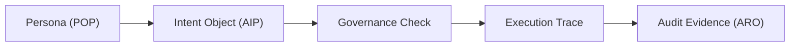

<!-- language-switch:start -->
[English](./README.md) | [中文](./README.zh-CN.md)
<!-- language-switch:end -->

# 可验证代理演示

这个仓库是 Digital Biosphere Architecture 中 execution-evidence 路径的 walkthrough demo。

它不是 canonical architecture hub，不是 canonical evidence-profile spec，也不是 audit control plane。

## 角色

`verifiable-agent-demo` 是 execution-evidence 路径的引导演练表面。它展示了一条从 persona 和 intent 出发，经过 governance、execution integrity、具体 evidence packaging，最终到 post-execution review 的紧凑路径。

## 不是这个仓库

- 不是 canonical architecture hub
- 不是 canonical evidence-profile spec
- 不是 audit control plane
- 不是具体的 evidence package
- 不是基准套件

## 最快的可运行路径

这个仓库证明这条路径，`agent-evidence` 是证据基底，`aro-audit` 是审计控制面。

最快的本地运行：

```bash
python3 -m demo.agent
```

最快的企业沙盒工件链：

```bash
python3 examples/enterprise_sandbox_demo/run.py
```

这个沙盒运行会写出 `artifacts/enterprise_sandbox_demo/`，其中包含：

- `intent.json`
- `policy.json`
- `trace.jsonl`
- `sep.bundle.json`
- `replay_verdict.json`
- `audit_receipt.json`

## 从这里开始

- architecture context -> [digital-biosphere-architecture](https://github.com/joy7758/digital-biosphere-architecture)
- concrete evidence package -> [agent-evidence](https://github.com/joy7758/agent-evidence)
- post-execution review -> [aro-audit](https://github.com/joy7758/aro-audit)
- [文档/quick-walkthrough.md](docs/quick-walkthrough.md)
- [文档/交互流.md](docs/interaction-flow.md)
- [文档/最短验证循环.md](docs/shortest-validation-loop.md)

## 取决于

- [数字生物圈架构](https://github.com/joy7758/digital-biosphere-architecture)
- [代理证据](https://github.com/joy7758/agent-evidence)
- [aro-审计](https://github.com/joy7758/aro-audit)
- [角色对象协议](https://github.com/joy7758/persona-object-protocol)
- [智能体意图协议](https://github.com/joy7758/agent-intent-protocol)
- [代币监管者](https://github.com/joy7758/token-governor)
- [fdo-内核-mvk](https://github.com/joy7758/fdo-kernel-mvk)

## 地位

- 主动演练演示
- 研究附件对于演示路径来说仍然是次要的
- 不是 canonical entry 仓库

共同的教义：

**沙盒控制执行；便携式证据可验证执行情况。**

1. 治理决定应该允许什么。
2. 执行完整性证明了实际发生的情况。
3. 审计证据导出工件以供独立审查。



## 这个演示证明了什么

- 一个可移植的面向角色的入口点可以投射到运行时
- 可以在执行之前发出显式意图和操作对象
- 执行后可以发出结果对象
- 执行步骤可以被记录作为可检查的证据
- 面向审计的工件可以导出为有界输出

## 本演示中的架构路径

- 角色层 -> 运行时携带的 POP 对齐角色上下文
- 交互层 -> `interaction/` 下发出的意图、操作和结果对象
- 治理层 -> 被引用为运行时策略和预算约束的控制检查点
- 执行完整性层 -> 运行时执行跟踪和可验证的执行上下文
- 审计证据层 -> ARO 式导出的证据工件

该仓库并未声明完整的 Token Governor 集成。它展示了跨更广泛堆栈的最小对齐路径，并在发出的交互和结果对象中提供了显式的治理检查点引用。

它现在还包括一个固定的企业沙箱工件链，用于
场景 `organize client visit notes -> generate weekly report -> request approval`，
但仍然没有声称具有通用的全栈 Token Governor 集成。

## 如何阅读此演示

这个 demo 是最短的引导演练，不是 architecture、evidence package 或 audit layer 的 canonical entry。系统上下文请看 [digital-biosphere-architecture](https://github.com/joy7758/digital-biosphere-architecture)，具体 evidence package 请看 [agent-evidence](https://github.com/joy7758/agent-evidence)，执行后审阅请看 [aro-audit](https://github.com/joy7758/aro-audit)。如果你要看分层定义，请继续到 [persona-object-protocol](https://github.com/joy7758/persona-object-protocol)、[agent-intent-protocol](https://github.com/joy7758/agent-intent-protocol)、[token-governor](https://github.com/joy7758/token-governor) 和 [fdo-kernel-mvk](https://github.com/joy7758/fdo-kernel-mvk)。

## 执行证据演示说明

请参阅[docs/execution-evidence-demo-note.md](docs/execution-evidence-demo-note.md)。

## 预期的工件

回购跟踪样本包：
- `interaction/intent.json`
- `interaction/action.json`
- `interaction/result.json`
- `evidence/example_audit.json`
- `evidence/result.json`
- `evidence/sample-manifest.json`

附加跟踪示例：
- `evidence/crew_demo_audit.json`

该仓库中当前的具体示例包括：

- `docs/quick-walkthrough.md`
- `docs/interaction-flow.md`
- `docs/shortest-validation-loop.md`

## 运行演示

### 脚本化包装器

```bash
bash scripts/run_demo.sh
```

该本地包装器在 `artifacts/demo_output/` 下写入新的输出。

### 最快的外部演示路径

```bash
bash scripts/run_demo.sh
make killer-demo
python3 -m http.server --directory docs 8000
```

企业沙盒工件链的回执现在通过规范的 ARO 界面
`aro_audit.receipt_validation` 以 `minimal` 配置文件进行检查。

## MVK -> AEP bridge 演示路径

`verifiable-agent-demo` 仍然是引导演示入口。`fdo-kernel-mvk` 负责证明执行完整性，包括 deterministic execution、replay validation 和 tamper detection。`agent-evidence` 负责 evidence packaging、signed export、offline verification 和 review pack。

新的 MVK -> AEP bridge 路径把 `fdo-kernel-mvk` 的 `audit_bundle.json` 导出为 AEP-compatible bundle，然后交给 `agent-evidence` 做验证、签名导出、打包和审阅交接。

最短跨仓库路径：

```bash
cd ../fdo-kernel-mvk
make demo
make verify-demo
make export-aep
make verify-aep

agent-evidence verify-bundle --bundle-dir mvk-aep-bundle
```

从本仓库运行的本地 wrapper：

```bash
make mvk-aep-bridge-dry-run
make mvk-aep-bridge-demo
```

`make mvk-aep-bridge-demo` 默认需要相邻克隆：

```text
../fdo-kernel-mvk
```

也可以覆盖路径：

```bash
MVK_REPO=/path/to/fdo-kernel-mvk make mvk-aep-bridge-demo
```

该演示不会 vendor 或 import `fdo-kernel-mvk` / `agent-evidence`。MVK bridge bundle 是本地、未签名的；signed export、signature verification 和 review pack 仍然属于 `agent-evidence`。

## AI / agent 入口

- `llms.txt`
- `AGENTS.md`
- `CITATION.cff`
- 主索引：digital-biosphere-architecture 的 `docs/ai-discovery-index.md`
- 引用地图：digital-biosphere-architecture 的 `docs/ai-citation-map.json`

这些文件用于帮助 AI / agent 更快发现、引用和复核本仓库角色，不是新的宣传材料。权威跨仓库索引仍然放在 `digital-biosphere-architecture`。

### 现有的 CrewAI 演示路径

```bash
bash scripts/setup_framework_venv.sh
.venv/bin/python crew/crew_demo.py
```

环境注意事项：

- Python 3 对于最小本地路径来说已经足够了。
- 使用 `python3 scripts/refresh_demo_samples.py` 刷新跟踪的确定性样本包。
- 可选的 CrewAI 和 LangChain 路径应从 `scripts/setup_framework_venv.sh` 创建的 git-ignored 本地 `.venv/` 运行。
- 固定框架帮助程序环境当前使用 `crewai 1.10.1`、`langchain 1.2.12` 和 `langchain-core 1.2.18`。
- CrewAI 目前需要 Python `<3.14`。
- 两个演示路径都使用确定性本地模拟数据，不需要外部 API 调用。

## 仓库自动化

- Mermaid 渲染工作流程仅通过专用的 GitHub 应用程序向 `main` 开放 PR。
- 在`Settings -> Secrets and variables -> Actions`下配置仓库变量`PROTOCOL_BOT_APP_ID`和仓库秘密`PROTOCOL_BOT_PRIVATE_KEY`。
- 默认仓库 `GITHUB_TOKEN` 保持只读状态，不用于自动 PR 升级。

## 研究评估附件

该仓库现在包括一个纸质评估工具，用于
`Execution Evidence Architecture for Agentic Software Systems: From Intent Objects to Verifiable Audit Receipts`。

主要入口点：

- `make eval-baseline`
- `make eval-evidence`
- `make eval-external-baseline`
- `make eval-framework-pair`
- `make eval-langchain-pair`
- `make eval-ablation`
- `make falsification-checks`
- `make human-review-kit`
- `make review-sample`
- `make compare`
- `make paper-eval`
- `make top-journal-pack`

支持材料：

- [任务套件](docs/paper_support/task-suite.md)
- [导出格式](docs/paper_support/export-format.md)
- [审核工作流程](docs/paper_support/review-workflow.md)
- [比较工作流程](docs/paper_support/comparison-workflow.md)
- [外部基线](docs/paper_support/external-baseline.md)
- [同架构比较](docs/paper_support/same-framework-comparison.md)
- [浪链对比](docs/paper_support/langchain-comparison.md)
- [消融研究](docs/paper_support/ablation-study.md)
- [人类回顾研究](docs/paper_support/human-review-study.md)
- [造假工作流程](docs/paper_support/falsification-workflow.md)

生成的输出：

- `artifacts/runs/<task_id>/<mode>/`
- `docs/paper_support/comparison-summary.md`
- `docs/paper_support/comparison-summary.csv`
- `artifacts/metrics/comparison-summary.json`
- `docs/paper_support/external-baseline-summary.md`
- `docs/paper_support/framework-pair-summary.md`
- `docs/paper_support/langchain-pair-summary.md`
- `docs/paper_support/ablation-summary.md`
- `docs/paper_support/falsification-summary.md`
- `artifacts/human_review/synthetic-review-summary.json`

## 研究手稿草稿

该仓库还包括基于当前实施的工具和签入指标的手稿草案：

- [纸/乳胶/README.md](paper/latex/README.md)
- `paper/latex/main.tex`
- 本地编译后的`paper/latex/main.pdf`

## 相关仓库

- [数字生物圈架构](https://github.com/joy7758/digital-biosphere-architecture) - 系统概述和规范架构中心
- [persona-object-protocol](https://github.com/joy7758/persona-object-protocol) - 可移植的角色对象层
- [agent-intent-protocol](https://github.com/joy7758/agent-intent-protocol) - 语义交互层
- [token-governor](https://github.com/joy7758/token-governor) - 运行时治理和预算策略控制层
- [aro-audit](https://github.com/joy7758/aro-audit) - 审计证据和面向一致性的验证层

## 最小参考面

- `interaction/` 用于显式交互对象
- `evidence/` 用于审核和结果工件
- `demo/` 和 `crew/` 用于可运行入口点
- `integration/` 用于角色和意图适配器
- `docs/spec/` 用于模式注释和示例有效负载

## 进一步阅读

- [快速演练](docs/quick-walkthrough.md)
- [交互流程](docs/interaction-flow.md)
- [最短验证循环](docs/shortest-validation-loop.md)
- [MVK -> Agent Evidence bridge walkthrough](docs/mvk-aep-bridge-walkthrough.md)
- [独立验证](docs/independent-verification.md)
- [架构](docs/architecture.md)
- [演示文物](docs/demo-artifacts.md)
<!-- render-refresh: 20260311T205242Z -->
