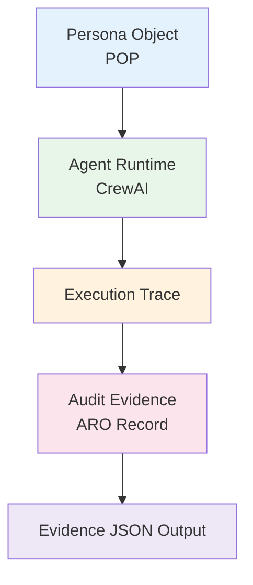

# Agent Governance Pipeline

Minimal governance pipeline for AI agents.

Layers:

Identity -> Persona Object (POP)
Execution -> Agent Runtime (CrewAI)
Trace -> Execution trace capture
Audit -> ARO-style evidence record
