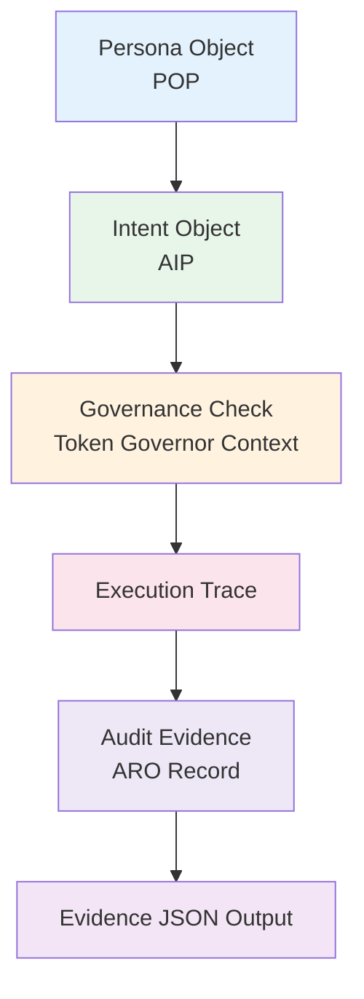

# Agent Governance Pipeline

Minimal governance pipeline for AI agents.

Layers:

Identity -> Persona Object (POP)
Interaction -> Intent Object (AIP)
Governance -> Pre-execution checkpoint
Execution -> Execution trace capture
Audit -> ARO-style evidence record
