# Verifiable Agent Execution

Minimal governance infrastructure for AI agents.

---

## Architecture



---

## Pipeline

FAIR Digital Objects
-> Verifiable Digital Objects
-> Agent Governance Stack
-> Verifiable Digital Evidence

---

## Demo

Run locally:

```bash
bash scripts/run_demo.sh
```

CrewAI example:

```bash
bash scripts/setup_framework_venv.sh
.venv/bin/python crew/crew_demo.py
```

Output:

```text
evidence/example_audit.json
```

---

## Core Projects

Persona Object Protocol
https://github.com/joy7758/persona-object-protocol

ARO Audit
https://github.com/joy7758/aro-audit

Token Governor
https://github.com/joy7758/token-governor

Verifiable Agent Demo
https://github.com/joy7758/verifiable-agent-demo

---

## Research Context

This work explores governance infrastructure for autonomous AI agents:

Identity -> Execution -> Trace -> Audit -> Governance
